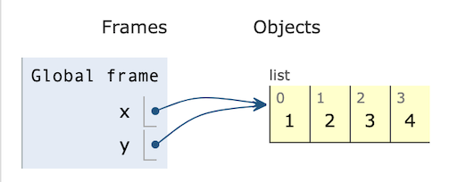
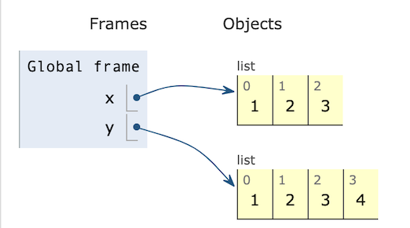
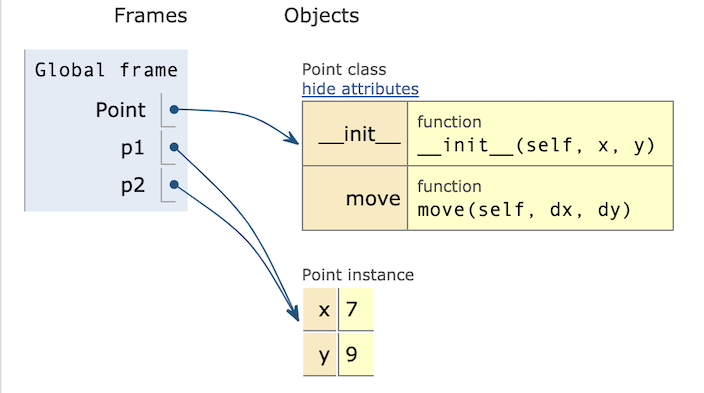
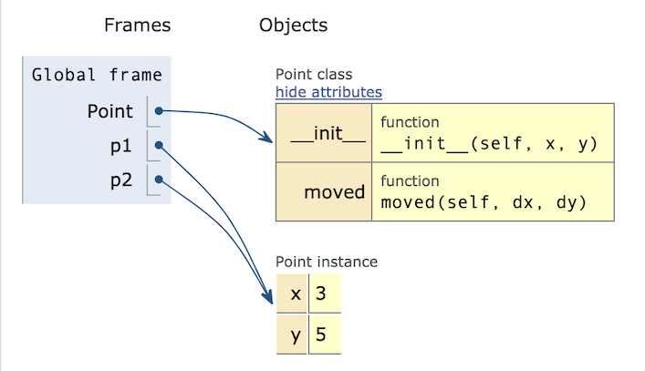
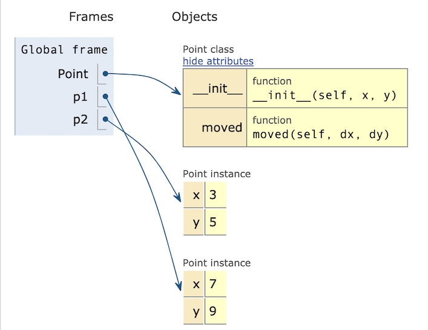

In Python, objects are used to represent 
information.  Every variable you use in a Python 
program is a reference to an object.
The values you have been using so far – 
numbers, strings, dicts, lists, etc – are objects. 
They are among the built-in classes of Python, 
i.e., kinds of value that are already defined 
when you start the Python interpreter.  

You are not limited to those built-in classes. 
You can use them as a foundation to build your 
own. 

## Example: Points

What if we wanted to define a new kind of value?
For example, if we wanted to write a program 
to draw a graph, we might want to work with 
cartesian coordinates, representing each 
point as an (x,y) pair.  We might represent the 
point as a tuple like `(5,7)`, or we could represent 
it as the list `[5, 7]`, or we could represent
it as a dict `{"x": 5, "y": 7}`, and that 
might be satisfactory.   If we wanted to represent moving a point (x,y) by some distance (dx, dy), we could define a a function like 

```python
def move(p, d):
    x,y = p
    dx, dy = d
    return (x+dx, y+dy)
```

But if we are making a graphics program, we'll need to *move* functions for other graphical objects like rectangles and ovals, 
so instead of naming it `move` we'll need a more descriptive name 
like `move_point`.  Also we should give the type contract for 
the function, which we can do with Python type hints.  With these 
changes, we get something like this

```python
from typing import Tuple
from numbers import Number

def move_point(p: Tuple[Number, Number],
               d: Tuple[Number, Number]) \
        -> Tuple[Number, Number]:
    x, y = p
    dx, dy = d
    return (x+dx, y+dy)
```

A simple test case increases our confidence that this works: 

```python
assert move_point((3,4),(5,6)) == (8,10)
```

### Can we do better? 

We aren't really satisfied with using tuples to 
represent points.  What we'd really 
like is to express the concept of adding two points 
more concisely, as `(3,4) + (5,6)`.  What would happen if we 
tried this? 

```cli 
>>> (3,4) + (5,6)
(3, 4, 5, 6) 
```

That's not what we wanted!  Would it be better if we represented 
points as lists? 

```cli
>>> [3,4] + [5,6]
[3, 4, 5, 6]
```

No better.  Maybe as dicts? 

```cli
>>> {"x": 3, "y": 4} + {"x": 5, "y": 6}
Traceback (most recent call last):
  File "<input>", line 1, in <module>
TypeError: unsupported operand type(s) for +: 'dict' and 'dict'
```

That is certainly not an improvement.  What we really want is not to use one of the existing representations like lists or tuples or dicts, but to define a new representation for points.  

## A new representation

Each data type in Python, including list, tuple, and dict, is defined as a *class* from which *objects* can be constructed.  We can also define our own classes, to construct new kinds of objects.   For example, we can make a new class `Point` to represent points.  

```python
class Point:
    """An (x,y) coordinate pair"""
```

Inside the class we can define *methods*, which are like functions 
that are specialized for the new representation.   The first 
method we should define is a *constructor* with the name `__init__`. 
The constructor describes how to create a new `Point` object: 

```python
class Point:
    """An (x,y) coordinate pair"""
    def __init__(self, x: Number, y: Number):
        self.x = x
        self.y = y
```

## Instance variables 

Notice that the first argument to the constructor method is 
`self`, and within the method we refer to `self.x` and `self.y`.  
In a method that operates on some object *o*, the first argument
to the method will always be `self`, which refers to the whole 
object *o*.   Within the `self` object we can store *instance 
variables*, like `self.x` and `self.y` for the *x* and *y* coordinates of a point.  

## Methods

What about defining an operation for moving a point?  Instead of 
adding `_point` to the name of a `move` function, we can just 
put the function (now called a *method*) *inside* the `Point` 
class:

```python
class Point:
    """An (x,y) coordinate pair"""
    def __init__(self, x: Number, y: Number):
        self.x = x
        self.y = y

    def move(self, d: "Point") -> "Point":
        """(x,y).move(dx,dy) = (x+dx, y+dy)"""
        x = self.x + d.x
        y = self.y + d.y
        return Point(x,y)
```

Notice that the *instance variables* `self.x` and `self.y` we created in the constructor 
can be used in the `move` method.  They are part of the 
object, and can be used by any method in the class.  The instance variables of the other `Point` object `d` are also available 
in the `move` method.  Let's look at how these objects are 
passed to the `move` method. 

## Method calls

Next we'll create two `Point` objects and call the `move` method 
to create a third `Point` object with the sums of their *x* and 
*y* coordinates: 

```python
p = Point(3,4)
v = Point(5,6)
m = p.move(v)

assert m.x == 8 and m.y == 10
```

At first it may seem confusing that we defined the ```move``` method with two arguments, `self` and `d`, but 
it looks like we passed it only one argument, `v`.  In fact 
we passed it both points:  `p.move(v)` passes `p` as the `self` argument and `v` as the `d` argument.  We use the variable 
before the `.`, like `p` in this case, in two different ways: To find the right method (function) to call, by looking inside the *class* to 
which `p` belongs, and to pass as the `self` argument to the method.

The `move` method above returns a new `Point` object at the 
computed coordinates.  A method can also change the values of 
instance variables.   For example, suppose we add a `move_to` 
method to `Point`: 

```python
    def move_to(self, new_x, new_y):
        """Change the coordinates of this Point"""
        self.x = new_x
        self.y = new_y
```

This method does not return a new point (it returns `none`), but 
it changes an existing point.  

```python
m.move_to(19,23)

assert m.x == 19 and m.y == 23
```

## A little magic

We said above that what we really wanted was to express 
movement of points very compactly, as addition.  We 
saw that addition of tuples or lists did not act as we 
wanted;  instead of `(3,4) + (5,6)` giving us `(8,10)`, it 
gave us `(3,4,5,6)`.  We can almost get what we want by describing 
how we want `+` to act on `Point` objects.  We do this by 
defining a *special method* `__add__`: 

```python
    def __add__(self, other: "Point"):
        """(x,y) + (dx, dy) = (x+dx, y+dy)"""
        return Point(self.x + other.x, self.y + other.y)
```

Special methods are more commonly known as *magic methods*. They allow us to define how arithmetic operations like `+` and `-` work for each class of object, as well as comparisons like `<` and `==`, and some other operations.  If `p` is a `Point` object, then `p + q` is interpreted as `p.__add__(q)`.  So finally we get a very compact and readable notation: 

```python
p = Point(3,4)
v = Point(5,6)
m = p.move(v)

assert m.x == 8 and m.y == 10
```
## Variables *refer* to objects

Before reading on, try to predict what the following
little program will print.

```python
x = [1, 2, 3]
y = x
y.append(4)
print(x)
print(y)
```

Now execute that program.  Did you get the result you 
expected?  If it surprised you, try visualizing it in 
PythonTutor (http://pythontutor.com/).  You should get a 
diagram that looks like this: 




`x` and `y` are distinct variables, but they are both references to the same list.   When we change `y` by appending 4, we are changing the same object 
that `x` refers to.   We say that `x` and `y` are *aliases*, two names for the same object. 

Note this is very different from the following: 

```python
x = [1, 2, 3]
y = [1, 2, 3]
y.append(4)
print(x)
print(y)
```

Each time we create a list like `[1, 2, 3]`, we are creating a distinct 
list.  In this seocond version of the program, `x` and `y` are not 
aliases. 



It is essential to remember that variables hold *references* to objects, and 
there may be more than one reference to the same object.  We can observe the 
same phenomenon with classes we add to Python.  Consider this program: 

```python
class Point:
    """An (x,y) coordinate pair"""
    def __init__(self, x: int, y: int):
        self.x = x
        self.y = y

    def move(self, dx: int, dy: int):
        self.x += dx
        self.y += dy

p1 = Point(3,5)
p2 = p1
p1.move(4,4)
print(p2.x, p2.y)
```

Once again we have created two variables that are *aliases*, i.e., they 
refer to the same object.   PythonTutor illustrates: 




Note that `Point` is a reference to the *class*, while `p1` and `p2` are references to the Point *object* we created from the Point class.  When we call `p1.move`, the `move` method of class `Point` makes a change to 
the object that is referenced by both `p1` and `p2`.  We often say that 
a method like `move` *mutates* an object. 

There is another way we could have written a method like `move`.  
Instead of *mutating* the object (changing the values of its *fields* 
`x` and `y`), we could have created a new Point object at the 
modified coordinates: 

```python
class Point:
    """An (x,y) coordinate pair"""
    def __init__(self, x: int, y: int):
        self.x = x
        self.y = y

    def moved(self, dx: int, dy: int) -> "Point":
        return Point(self.x + dx, self.y + dy)

p1 = Point(3,5)
p2 = p1
p1 = p1.moved(4,4)
print(p1.x, p1.y)
print(p2.x, p2.y)
```

Notice that method `moved`, unlike method `move` in the prior example, 
return a new Point object that is distinct from the Point object that was aliased.  Initially `p1` and `p2` may be aliases, after `p2 = p1`: 



But after `p1 = p1.moved(4,4)`, `p1` refers to a new, distinct object: 


