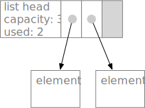
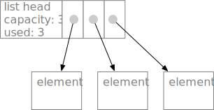
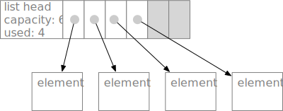
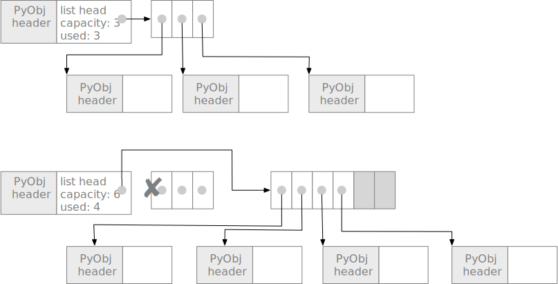
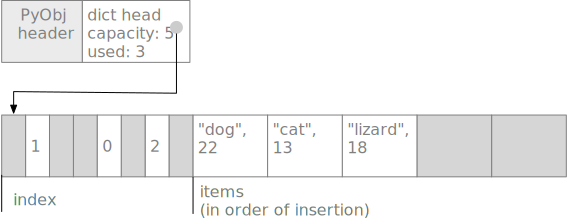

## Or: Seven things they never told you about Python.  Number 5 will blow your mind.

You write programs in Python to run with the Python interpreter, 
but the Python interpreter itself is a computer program. 
Let's look inside. 

## Use the source, Luke

Although there are alternative implementations of Python, when 
someone mentioned "the Python interpreter", they usually mean 
CPython.  That's the version of Python that you can download and 
install from `python.org`.  CPython 2.x and CPython 3.x are both 
versions of CPython. 

CPython is an open source project.  It is hosted on GitHub, 
like our projects, but it is somewhat larger.  You can 
find it at [`https://github.com/python/cpython`](https://github.com/python/cpython). 
Perhaps one day you will contribute a new feature to CPython, or fix a bug. 

As a relatively new developer, it is likely a little daunting to 
dive into a codebase of this size and complexity, but there is 
documentation to help you when you are ready. 
An overall guide for developers who want to contribute 
to the Python project can be found at 
[`https://devguide.python.org/`](https://devguide.python.org/). 
A more general guide for understanding Python's internals, even if you do not 
want to contribute to Python's development, can be found 
at [`https://devguide.python.org/exploring/`](https://devguide.python.org/exploring/). 

Philip Guo, creator of the wonderful [PythonTutor](http://pythontutor
.com/), has recorded lectures of a class he taught on on internals 
 of CPython 2.7.  I have watched only parts.  They are very good, as
  I would expect, but move a little slowly because they are
   recordings of actual class interactions. You can find them at 
[`http://pgbovine.net/cpython-internals.htm`](http://pgbovine.net/cpython-internals.htm).

I expect these guides and the source code itself will be more accessible to 
you when you are a little farther along in computer science.  In the remainder 
of this document, I'll try to describe some key aspects of how
 CPython 3 works, 
but in less detail and with fewer assumptions about your background. 

## Translation and Execution 

CPython is an interpreter. That means it reads Python source code and then 
executes instructions that "interpret" the program.  In CIS 211 you  
write an interpreter for a calculator, and in the final project you 
write a compiler for a simple language to run on the Duck Machine.  
CPython is more complex, but not essentially different. 

The CPython interpreter works in two phases.  In the first phase, CPython 
translates Python source code into an intermediate, lower-level representation. 
The lower level representation is designed to be efficient for execution, 
and is not readily readable by humans. It is a sequence of instructions for 
a Python _virtual machine_, which is a program simulating a special purpose 
Python computer. 

The Python virtual machine, or byte code interpreter, is a simulated 
computer like our Duck Machine.  Unlike our Duck Machine, though, it 
is not designed to be simulate a real hardware computer.  It is instead 
an imaginary machine specialized for executing Python programs.  It doesn't
have registers like the Duck Machine, but it has several data structures 
for managing Python program execution.  One of the key data structures 
is a _stack_.  Virtual machines like the one in CPython are called 
_stack machines_ because their _stack_ is used much the way 
registers are used in a physical computer. 

Each of the operations of the Python 
virtual machine is more complex than 
individual operations on the Duck Machine. 
Since the Python virtual machine is a stack 
machine, the byte code instructures are arranged 
in postfix order, much like the input of our calculator. 
For example, this small Python function: 

```python
def simple(a: int, b: int) -> int:
    x = 11
    c = a + b * x
    return c
```

is translated into the following byte code instructions: 

``` 
LOAD_CONST  1   # Push constant 11, which is at location 1
STORE_FAST  2   # Pop and store in x, at location 2
LOAD_FAST   0   # Push first argument a, found at address 0
LOAD_FAST   1   # Push second argument b, found at address 1
LOAD_FAST   2   # Push value of x 
BINARY_MULTIPLY # Pops values of x and b, pushes x*b
BINARY_ADD      # Pops values x*b and a,  pushes a + x*b
STORE_FAST  3   # Pop sum and store in variable c
LOAD_FAST   3   # Push value of c, found at address 3
RETURN_VALUE    # Pop value and return it
```

This is not very clever code!  Note how it pops a value to store
in variable `c`, then immediately pushes that value back on the 
stack before returning it.  When you write a code generator, 
do not despair over the quality of code you produce.  Code generators
written by experts are pretty bad too.  (Language translators often 
have an optional _optimization_ phase that improves the generated 
code somewhat.)

What does the `BINARY_ADD` byte code instruction do?  You already 
know:  It calls the `__add__` method on its operand.  This is a 
very complex operation compared to the simple operations performed
by each instruction in a physical CPU. 

## Python translation compared to Java, C, etc

Many language implementations use a two-step process 
much like Python.  If you have programmed in Java, 
the first part (translation to byte code) was what the 
`javac` program did, and the second part (executing 
the byte code) was what the `java` program did.  The 
Java virtual machine differs from the Python virtual 
machine in several regards, but it too is a stack machine. 

Some language implementations take a different approach, 
translating the source language (like C or C++) to 
the actual machine code of a physical machine. This is 
called "compiling" or "compiling to native code". 
The CPython interpreter itself is a C program that has 
been compiled to native code, which might be the machine 
code for an Intel x86 processor or the machine code for 
an ARM CPU (for example, if you run Python on a 
Raspberry Pi). 

In principle the same language can be translated in different 
manners.  There is nothing to prevent building an interpreter 
for C (and it has been done), and it is possible in principle 
to build a native code compiler for Python (but it's not easy). 
In practice, some language designs lend themselves to native 
code compilation, and some make it more difficult.  Python was 
designed to be an interpreted language. 

Further reading:  There is a very nice, basic description of 
the Python virtual stack machine at 
[https://www.ics.uci.edu/~brgallar/week9_3.html](https://www.ics.uci.edu/~brgallar/week9_3.html). 


## Key Data Types in CPython

The built-in object types in Python include integers, 
strings, lists, and dicts.  There is a built-in class 
for each of these.  The built-in classes are almost like 
classes you define in Python, but they are actually written 
in C. 

All Python objects, from integers to classes to strings, are 
represented by `PyObject` structures (`struct`) in the CPython
code.   All `PyObject` structures have a header part, which contains
a reference to its type (which in Python is a `class` object)
and a _reference count_, used by the garbage collector.
Information specific to each built-in type in Python follows the
`PyObject` header.  


## Class `list`

A Python `list` is represented by a structure sometimes called a 
*flexible array*.  After the headers, elements of the list (which are 
always references to other objects) are stored in an array.  We call 
it a *flexible* array because the list has a capacity that may be 
greater than the number of elements currently in the list.  For
 example, if we had a list with two elements  



the `append` method would use the next available space in the array
and update information in the list headers part of the structure.  



This makes the `append` and `pop` methods very efficient if you always
append and pop at the end of the list.  If the capacity of the list 
is exhausted, appending a new element requires allocating a larger 
flexible array. 



The details are a little more complicated.  First, a `list` object, 
like all Python objects, starts with a header that identifies the 
type of the object and holds some bookkeeping information for the 
garbage collector (the component that recycles unused objects).
Second, Python can't just put the flexible part of the object adjacent
to the header in memory, because there might not be available space to 
expand it when its capacity is exhausted.  So, instead, the header 
contains a pointer to the variable part.  When we expand the capacity 
of the flexible array, we discard the old area (allowing the garbage 
collector to recycle it) and allocate a new one. 



Python never moves object headers.  This is so that an object reference 
in Python can be represented simply as a memory address.  If object
 headers
 moved around, references would either need a more complex
  representation, or 
 else all references to an object would need to be modified when the
 object header moved.  In consequence, all the mutable container
 classes of Python (lists, dicts, sets, strings) have a fixed header
 with a pointer to the part that can grow. 
 
### Class `int`

Although memory hardware is not really "typed", CPUs have 
operations like ADD that treat values as integers.
Most programming languages have an integer type that 
is essentially just a 32-bit or 64-bit integer exactly 
as supported by the hardware.  Python's `int` class is 
different.  A Python `int` is actually an object wrapper for 
a variable length list of integers.  Python uses this 
representation so that it can deal with very large numbers, 
even larger than 64 bits which is typically the upper 
limit for integers in languages like Java and C. 
When you add two large integers, Python may actually execute 
a loop to add up corresponding parts!  

Because the `int` class really is a class, it has methods 
like any other class.  When we add `int` objects, we call the 
`__add__` method just like we would if we were adding strings 
(whose `__add__` method concatenates strings).  The `__add__`
method for `int`, and all the other arithmetic methods for `int`, 
are implemented in C.  

While some `int` objects may have more digits than others, and 
therefore occupy more a larger area of memory, `int` objects never
have to grow because they are *immutable*.  When you add 329 and 41, 
you do not change 329 or change 41, but rather create a new `int`
object to hold the value 370. Because they are immutable, an `int`
object need not be split into a fixed part and a variable part 
like a `list` object. 

While the standard integer representation in all modern 
computers I am aware of uses 2s complement representation 
for negative numbers, Python uses sign and magnitude
representation.  The magnitude is represented by a sequence
of 30-bit "digits". The number of digits is stored in the 
header of the `int` object.  Since the number of digits can
never be negative, a digit count of $-k$ is used to indicate
that there are $k$ digits and the value is negative.  For
example, a very large negative integer might have a size field
of $-3$, indicating that it requires three 30-bit digits (each 
of which is represented as a non-negative integer) and that the value
is negative. 


The sign and magnitude representation and variable length
complicate every arithmetic operation,
but the interpreter uses some clever tricks to make arithmetic 
on small numbers reasonably efficient.  There are special cases in the
interpreter code for integers small enough to fit entirely in a 32-bit
machine word.  Python also keeps a stash of common small values that
it reuses so that it doesn't have to create as many new `int` objects.
Nevertheless arithmetic in Python is much, much slower than arithmetic
in a language like C or Java.  

You might be aware that a lot of scientific computing is done in
 Python,
 and you might wonder how that can be feasible given the very
 inefficient (but flexible!) representation of `int`.  The answer is
 that high performance scientific programs do not depend too
 heavily on the built-in Python `int` type (nor even on `float`).
 Scientific computing relies heavily on the `scipy` and `numpy
 ` libraries,
 which provide their own implementation of arrays and matrices of
 numbers.  The numbers in those arrays and matrices are not Python
 `int` or `float` numbers, but rather a more basic, less flexible
 representation, exactly as you would find in C or C++ code (and in
 fact implemented in C). 


### Class `dict`

A `dict` is implemented as a *hash table*.  Like a list, it is a
container class that might need to be expanded as items are added, 
so it is broken into a head part with a fixed address and a
content part of "payload" that can be reallocated with a larger
capacity.  

Hash tables (called "hashmaps" in Java) are a form of "scatter
 storage".   Let's consider the dict `{ "dog": 22, "cat": 13 }`, 
 and assume the `dict` structure initially has room for 5 (key, value)
 pairs.
 
 
 
 The _items_ part of the structure
 holds the (key, value) pairs (which are 
 actually references to other objects).
 Each new entry is just appended, as in the 
 `list` structure.  Indexes of their positions are
 scattered in the _index_ part of the structure.
 The scattering is determined by a _hash function_.
 A hash function (or just _hash_) of a key is a
 function that maps the key deterministically to a
 value that is somewhat random (but always the same
 for a given key). For example, `hash("dog")` might return 28. 
 There are only 8 slots in the index, so we take
 28 mod 8 to compute the index 4.  Slot 4
 of the index part contains 0,
 indicating that the entry for "dog" is in slot 0
 of the _items_ part of the structure.  
 
 Suppose we give the command `d["lizard"] = 18` to add 
 ("lizard", 18) to the hash table.  Maybe `hash("lizard")`
 returns 36.  36 mod 8 is 4, the same as 28 mod 8, and
 slot 4 of the index already contains a reference to the entry
 for ("dog", 22).  This is called a _hash collision_ or
 just _collision_, because the hash indexes for
 "dog" and "lizard" have _collided_ at slot 4.
What should we do?  

Python uses a
 _collision resolution_ approach called _open addressing_.
 You might also summarize it as "if once you don't succeed,
 try, try again".  Slot 4 is taken, so Python adds something
 to the index, again reduces it modulo the number of elements
 in the index portion of the structure, and tries again.
 Let's say it adds 5, so it next tries slot (5 + 4) mod 8,
 which is 1.  But slot 1 is also in use!  So it adds a larger
 number, maybe 197.  (197 + 1) mod 8 is 6, so it tries slot
 6.  That slot is empty, so it stores 2 in that slot to
 indicate that slot 2 in the items part is where ("lizard", 18)
 can be found.
 

 
 If we write `x = d["lizard"]`, the same set of _probes_ occurs:
 We hash "lizard" and get 36 % 8, and looking in slot 4 of
 the indexes we find 0.  We check slot 0 of the items part, but
 instead of "lizard" we find "dog".  Next we add 5, which leads
 us to check entry 1, but we find "cat" instead of "lizard".  Finally
 we try slot 6 of the indexes, which leads us to slot 2 of the items,
 where we find ("lizard", 18).  If we instead landed on an empty
 slot in the indexes, we would conclude that there was no key "lizard"
 and raise a key error. 
 
 Note that in our example, the capacity of the hash table is 
 5 items, but there are 8 slots in the index part of the
 structure.  We want to minimize the number of collisions, and we
 want the _probe sequences_ (like the sequence 4, 1, 6 for "lizard")
 as short as possible, but without wasting too much space.  At present
 Python 3 allocates about 1.5 times as many index slots as
 elements.  It uses a quadratic probe sequence that ensures that,
 if there is at least one empty index slot, it will always be
 found eventually.  The variable size portion of the dict structure
 is reallocated whenever the items part is exhausted, so there will
 always be available index slots. 
 
 

## References 

In addition to Python official documentation, 
I have relied partially on some of these: 

Brayan Rafael Gallardo, summary of class notes from UC Irvine 
ICS 33 (based on lectures and notes by Richard Pattis), 2016. 
[https://www.ics.uci.edu/~brgallar/index.html](https://www.ics.uci.edu/~brgallar/index.html)

Artem Golubin, "Python internals: Arbitrary-precision integer 
implementation", 2017. 
[https://rushter.com/blog/python-integer-implementation/](https://rushter.com/blog/python-integer-implementation/)

Python Software Consortium.  [CPython version 3 source code repository](https://github.com/python/cpython)
